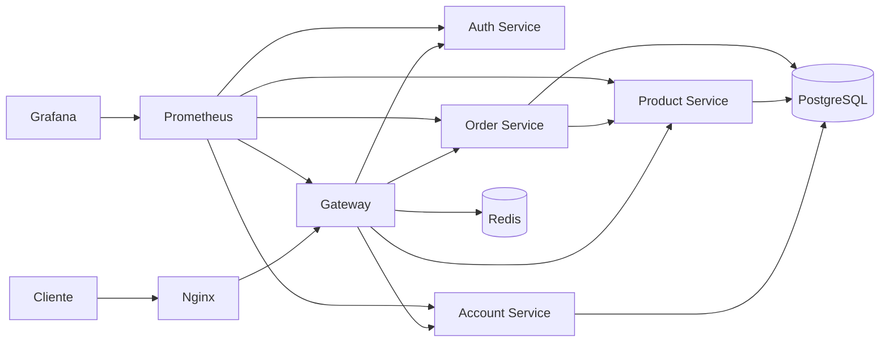

# Documentação do Projeto

## Visão geral

O projeto, desenvolvido por Matheus Vicco e Helio Henrique Navarro, é uma plataforma de loja baseada em microsserviços. Cada domínio da aplicação fica isolado em um serviço próprio, com comunicação HTTP entre serviços e infraestrutura local via Docker Compose.

## Arquitetura



## Minha contribuição

Minha contribuição individual foi a implementação e documentação dos serviços:

- `product-service`: catálogo de produtos.
- `order-service`: pedidos, itens de pedido, cálculo de totais e integração com produtos.

## Fluxo principal

1. O usuário cria ou consulta produtos pelo `product-service`.
2. O usuário cria um pedido enviando `idProduct` e `quantity`.
3. O `order-service` consulta o `product-service` para validar o produto e obter o preço.
4. O `order-service` calcula total por item e total do pedido.
5. O pedido é persistido em PostgreSQL.
6. As métricas dos serviços ficam disponíveis para Prometheus e Grafana.

## Execução local

Na pasta `api`, a aplicação pode ser executada com Docker Compose:

```bash
docker compose up --build
```

Serviços relevantes para minha entrega:

| Serviço | Host interno | Porta interna |
|---|---|---|
| Product | `product-service` | `8080` |
| Order | `order-service` | `8080` |
| PostgreSQL | `postgres` | `5432` |
