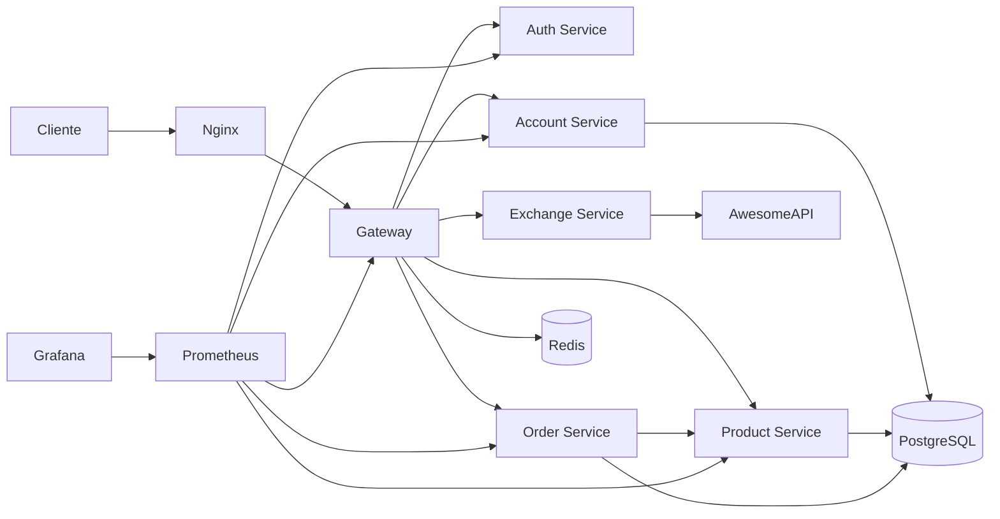

# Documentação do Projeto

## Visão geral

O projeto, desenvolvido por Matheus Vicco e Helio Henrique Navarro, é uma plataforma de loja baseada em microsserviços. Cada domínio da aplicação fica isolado em um serviço próprio, com comunicação HTTP entre serviços, execução local via Docker Compose e deploy em EKS com pipelines Jenkins.

## Arquitetura



## Contribuições do grupo

O projeto foi desenvolvido em grupo por Matheus Vicco e Helio Henrique Navarro. A documentação destaca os serviços implementados e integrados na plataforma:

- `product-service`: catálogo de produtos, preço e estoque.
- `order-service`: pedidos, itens de pedido, cálculo de totais e integração com produtos.
- `exchange-service`: consulta de câmbio entre moedas.
- `gateway-service`: roteamento central para os serviços.
- `auth-service` e `account-service`: autenticação e contas.

## Fluxo principal

1. O usuário cria ou consulta produtos pelo `product-service`.
2. O usuário cria um pedido enviando `idProduct` e `quantity`.
3. O `order-service` consulta o `product-service` para validar o produto, obter o preço e verificar estoque.
4. O `order-service` calcula total por item, total do pedido e cria o pedido com status `CREATED`.
5. O pedido, seus itens e status são persistidos em PostgreSQL.
6. O usuário pode consultar taxas de câmbio pelo `exchange-service`.
7. As métricas dos serviços ficam disponíveis para Prometheus e Grafana.

## Execução local

Na pasta `api`, a aplicação pode ser executada com Docker Compose:

```bash
docker compose up --build
```

Serviços relevantes para minha entrega:

| Serviço | Host interno | Porta interna |
|---|---|---|
| Product | `product-service` | `8080` |
| Order | `order-service` | `8080` |
| Exchange | `exchange-service` | `8080` |
| Gateway | `gateway` | `8080` |
| PostgreSQL | `postgres` | `5432` |
